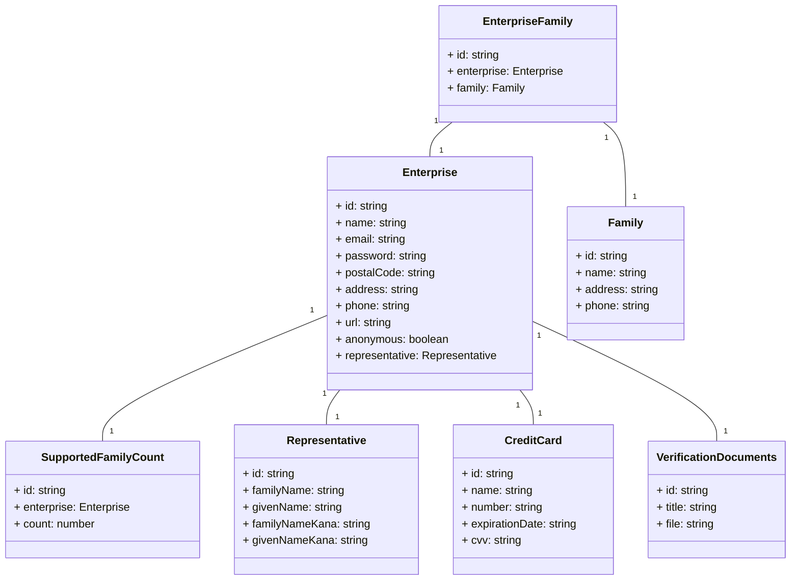

## モデリング

```mermaid
classDiagram
    class Enterprise {
        + id: string
        + name: string
        + email: string
        + password: string
        + postalCode: string
        + address: string
        + phone: string
        + url: string
        + anonymous: boolean
        + representative: Representative
    }
    class Representative {
        + id: string
        + familyName: string
        + givenName: string
        + familyNameKana: string
        + givenNameKana: string
    }
    class SupportedFamilyCount {
        + id: string
        + enterprise: Enterprise
        + count: number
    }
    class CreditCard {
        + id: string
        + name: string
        + number: string
        + expirationDate: string
        + cvv: string
    }
    class VerificationDocuments {
        + id: string
        + title: string
        + file: string
    }
    class Family {
        + id: string
        + name: string
        + address: string
        + phone: string
    }
    class EnterpriseFamily {
        + id: string
        + enterprise: Enterprise
        + family: Family
    }
    EnterpriseFamily "1" -- "1" Enterprise
    EnterpriseFamily "1" -- "1" Family
    Enterprise "1" -- "1" SupportedFamilyCount
    Enterprise "1" -- "1" Representative
    Enterprise "1" -- "1" CreditCard
    Enterprise "1" -- "1" VerificationDocuments
```
